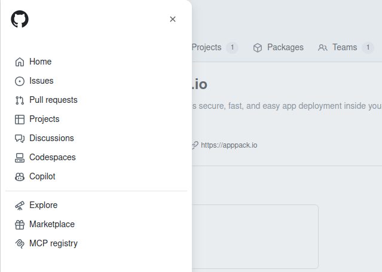
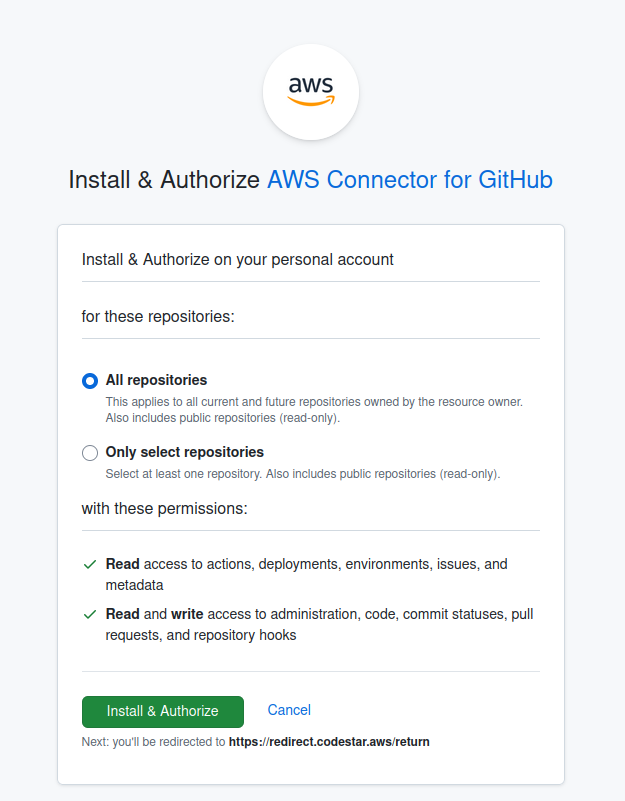
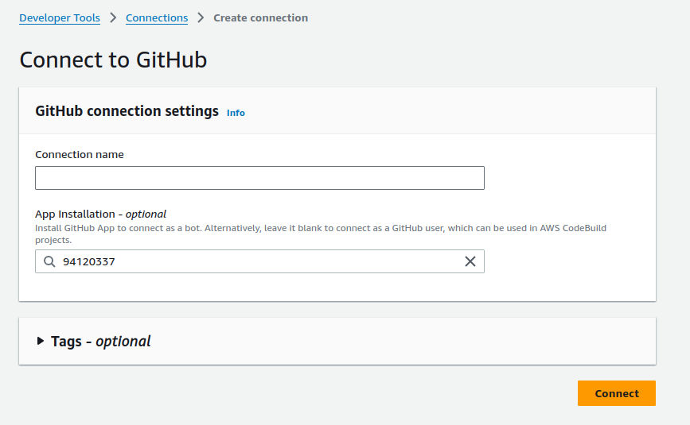
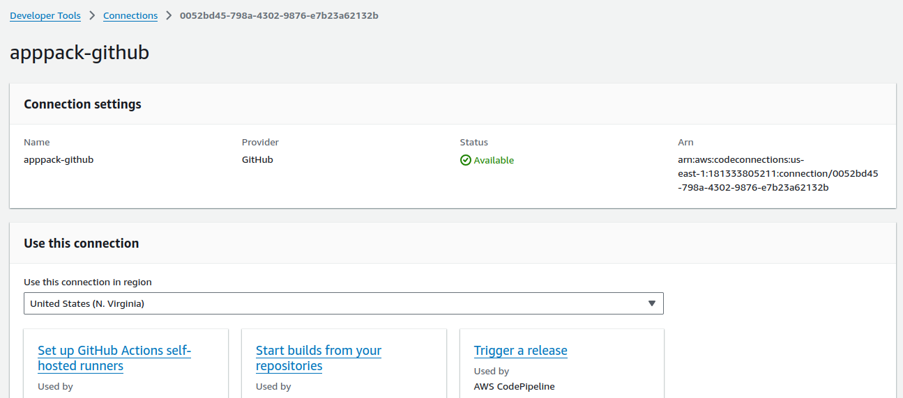

# Connect your AWS account to GitHub

Before you deploy an app using AppPack, you should connect your GitHub account 
to AWS using their free app. You can do it as part of the process of deploying 
an app, however the app appears to make some assumptions regarding any organisations 
you belong to, so it is best to set up the connection beforehand. This guide 
takes you through all the steps, so you can deploy apps from any of the repositories 
you have access to. Let's get started...

In the upper-left corner of any page on GitHub, click on the hamburger button to 
the left of the GitHub icon to display the site menu. Click on **Marketplace**:

In the search field, below **Enhance your workflow with extensions**, enter "AWS". 
In the search results you should see, "AWS Connector for GitHub":

Click on the panel. The README for the app will be displayed. Scroll down to the 
bottom to **Plans and Pricing**. The app is free of charge.

1. If shown, select the account where you want to install the app.
2. Click **Install".

The **Install & Authorize** page will be displayed:

1. At least initially, select **All Repositories**. 
2. Click on **Install & Authorize** to install the app.

You will be redirected to your AWS account. Sign in, then the **Connect to GitHub** 
page will be displayed:

1. Enter the name of the connection. Any name will do.
2. Click **Connect**

The connection details page will be displayed:

1. Select the region where you want to use the connection.

That's it. Now you can build applications from any of the repositories in your account.
