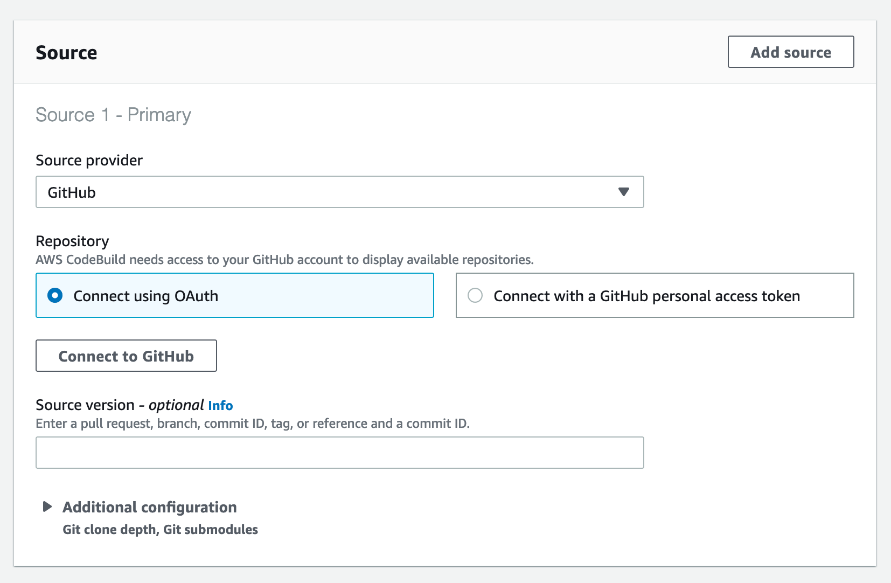
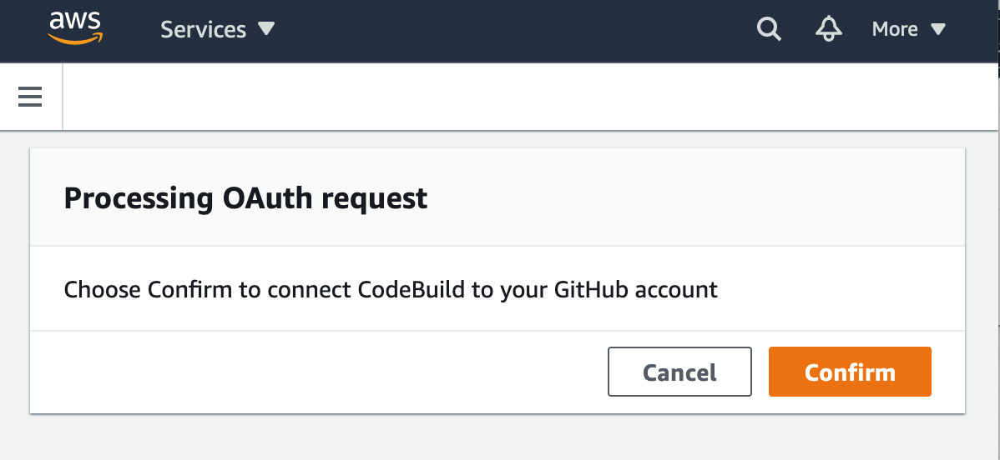

# Deploy your first app

This tutorial will walk you through deploying an app to your AWS account with AppPack.

## 📝 Prerequisites

Prior to starting this tutorial, be sure you've completed the [Initial Setup tutorial](./initial-setup.md) and received your account approval.

You'll also need a [GitHub Account](https://github.com).

## 🖥 The application

For this tutorial, we'll be deploying a simple "Hello World" Python web application from [`apppackio/apppack-demo-python`](https://github.com/apppackio/apppack-demo-python). This will familiarize you with the app creation and deployment process prior to deploying your own apps.

### 🔀 Fork the repository

AppPack will need access to create webhooks for the deployment pipeline, so you must fork the repository into your own account (personal or organization). [Click here to fork the repository](https://github.com/ipmb/apppack-demo-python/fork) to your account.

## 👷 Creating the application

!!! note
    The app creation process requires administrator access.

From your command line run:

```shell
apppack create app python-demo
```

You'll be prompted with some questions about the application. You can respond as follows:

1. _cluster to install app into_  
   You should just have one option here (`apppack`) and you can select it by hitting `Enter`
2. _repository URL_  
   Type the HTTP git URL to the repo you forked above, `https://github.com/<your_account>/apppack-demo-python.git`
3. _branch to setup for continuous deployment_  
   Type the name of the branch we'll be deploying from, `main`
4. _custom domain to route to app_  
   This is optional, so leave this blank by hitting `Enter`
5. _path which will return a 200 status code for healthchecks_  
   The app only has one URL at the site root, so type `/` here to use that as the healthcheck endpoint
6. _add-ons_  
   Next, you'll be asked about enabling a number of add-ons. You can answer `no` to all of them. This app does not use any add-ons such as databases or S3 buckets.
7. _email addresses for users who can manage the app (comma separated)_
    These will be the users who have access to manage the application once created. Be sure to add your own email address here and that of any collaborators.
   
!!! note
    AppPack has options for logging in via third-party authentication providers such as Google or GitHub. If you choose one of these make sure the email you give access to your app is the same one registered with the provider.

### 🤝 Connecting GitHub to CodeBuild

The first time you setup an app from GitHub, you'll be prompted to connect AWS CodeBuild with your GitHub account. Unfortunately, doing this is a little bit awkward. You'll be directed to a page in your browser which requires scrolling down to the *Source* section.



Choose `GitHub` in the "Source provider" input, select "Connect using OAuth", and click the "Connect to GitHub" button. You should be presented with a popup window to confirm the connection.



Once you've clicked "Confirm" in that popup, you've completed the connection. You can close the browser and continue on the command line.

---

The app creation should take around 2 minutes to create the necessary resources at AWS. When it completes successfully you should see:

```
✔ created python-demo app
```

## 🔐 Login to AppPack

Now that you've created the application, you can authenticate the CLI with AppPack to start working with the app. To login, run:

```shell
apppack auth login
```

!!! tip
    If you sign up for AppPack with your email address (as opposed to a third-party authentication provider), make sure you check your inbox. You should have an email with a link to verify email address. This step is required to authenticate the CLI and begin working with apps.

To verify you have access to the app, run:

```shell
apppack auth apps
```

You should get the following output:

```
=== Apps
Account: <your_aws_account> (us-east-1)
  python-demo
```

## 🛠 Triggering the first build

Now the AWS resources are prepared for your app, you need to trigger the CI/CD pipeline. Usually this is done automatically when you push new code to your repo, but in this case you'll trigger it manually.

To do that, run:

```shell
apppack -a python-demo build start --watch
```

This will trigger a build and track its progress in the output. You should see it go through each of the following phases:

1. Build
2. Test
3. Finalize
4. Deploy

## 🌐 Open the app

You should now be able to see the app in your browser by running:

```shell
apppack -a python-demo open
```

If you see "Hello World!" in your browser, congrats! Your first AppPack app is now running on AWS.

## 🏃 Next steps

Now that you've successfully installed an app pre-configured for AppPack to your cluster, you'll probably want to learn [how to configure your own app for AppPack](../how-to/apps/apps.md).

You should also destroy the demo app you created to avoid any unneccesary AWS charges. See _[How to Destroy an App](../how-to/apps/destroy-app.md)_ for details.

*[CI/CD]: Continuous Integration/Continuous Delivery
