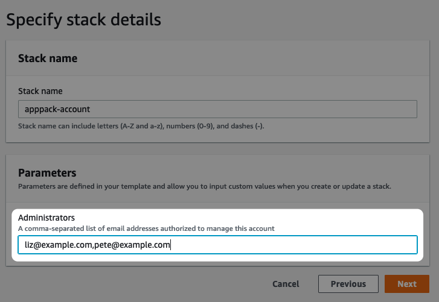

# Initial Setup

This tutorial will walk you through the initial AppPack setup in your AWS account. You will connect your AWS account to AppPack and setup your initial cluster for installing apps. This process should take about 25 minutes to complete, with the majority of waiting for AWS to spin up resources and setup a domain.

## 📝 Prerequisites

You'll need a few things ready to go to complete this tutorial. Make sure you've taken the following steps before getting started.

1. Installed **the `apppack` CLI** (see _[Install the CLI](../how-to/install.md)_)
2. Setup **an AWS account** with access to an admin user or role.
3. Setup **a free Docker Hub account and access token** (generated at [https://hub.docker.com/settings/security](https://hub.docker.com/settings/security)). This is required to avoid the [anonymous IP rate limits](https://docs.docker.com/docker-hub/download-rate-limit/) for pulling base images.


## 🏗 Setting up AWS Resources

⏳ _Estimated Time: 3 minutes_

Get started by clicking the "Launch Stack" button for your preferred region[^1] below. This will open up the AWS console and install the initial account-level resources so we can start using AppPack.

| Stack                                                                                                                                                                                                                                                                                                                                              | Region                                 |
|----------------------------------------------------------------------------------------------------------------------------------------------------------------------------------------------------------------------------------------------------------------------------------------------------------------------------------------------------|----------------------------------------|
| [](https://us-east-2.console.aws.amazon.com/cloudformation/home#/stacks/new?stackName=apppack-account&templateURL=https%3A%2F%2Fs3.amazonaws.com%2Fapppack-cloudformations%2Flatest%2Faccount.json){target=_blank}           | US East (Ohio) `us-east-2`             |
| [](https://us-west-2.console.aws.amazon.com/cloudformation/home#/stacks/new?stackName=apppack-account&templateURL=https%3A%2F%2Fs3.amazonaws.com%2Fapppack-cloudformations%2Flatest%2Faccount.json){target=_blank}           | US West (Oregon) `us-west-2`           |
| [](https://us-east-1.console.aws.amazon.com/cloudformation/home#/stacks/new?stackName=apppack-account&templateURL=https%3A%2F%2Fs3.amazonaws.com%2Fapppack-cloudformations%2Flatest%2Faccount.json){target=_blank}           | US East (N. Virginia) `us-east-1`      |
| [](https://ap-northeast-2.console.aws.amazon.com/cloudformation/home#/stacks/new?stackName=apppack-account&templateURL=https%3A%2F%2Fs3.amazonaws.com%2Fapppack-cloudformations%2Flatest%2Faccount.json){target=_blank} | Asia Pacific (Seoul) `ap-northeast-2`  |
| [](https://ap-south-1.console.aws.amazon.com/cloudformation/home#/stacks/new?stackName=apppack-account&templateURL=https%3A%2F%2Fs3.amazonaws.com%2Fapppack-cloudformations%2Flatest%2Faccount.json){target=_blank}         | Asia Pacific (Mumbai) `ap-south-1`     |
| [](https://ap-southeast-2.console.aws.amazon.com/cloudformation/home#/stacks/new?stackName=apppack-account&templateURL=https%3A%2F%2Fs3.amazonaws.com%2Fapppack-cloudformations%2Flatest%2Faccount.json){target=_blank} | Asia Pacific (Sydney) `ap-southeast-2` |
| [](https://eu-north-1.console.aws.amazon.com/cloudformation/home#/stacks/new?stackName=apppack-account&templateURL=https%3A%2F%2Fs3.amazonaws.com%2Fapppack-cloudformations%2Flatest%2Faccount.json){target=_blank}         | EU (Stockholm) `eu-north-1`            |
| [](https://eu-west-2.console.aws.amazon.com/cloudformation/home#/stacks/new?stackName=apppack-account&templateURL=https%3A%2F%2Fs3.amazonaws.com%2Fapppack-cloudformations%2Flatest%2Faccount.json){target=_blank}           | EU (London) `eu-west-2`                |


This will drop you into the AWS Cloudformation Stack creation form. It is split into four steps:

1. **Specify template**
      * Click `Next`
2. **Specify stack details**
      1. In the `Administrators` field, enter your email address and the email addresses of anyone else you'd like to grant full admin access to your account.
      
      2. Click `Next`
3. **Configure stack options**
      * Click `Next`
4. **Review**
      1. At the bottom of the page, check the box for _I acknowledge that AWS CloudFormation might create IAM resources._
      2. Click `Create stack`

[^1]: See [Choose an AWS Region](../how-to/choose-aws-region.md) for more info

## 🔐 Authenticate AppPack CLI

⏳ _Estimated time: 1 minutes_

Next, run:

```shell
apppack auth login
```

<script id="asciicast-BkCDHIskycHdYNt3e8rMjbUAt" src="https://asciinema.org/a/BkCDHIskycHdYNt3e8rMjbUAt.js" data-rows="8" async></script>

You'll be able to login or create a new account if you don't have one already. If you login with an email address and password, be sure to verify your email address before continuing.

Verify you are setup as an administrator:

```shell
apppack auth accounts
```

<script id="asciicast-oX0JCUxQVWytfqVXNaKaqE6eg" src="https://asciinema.org/a/oX0JCUxQVWytfqVXNaKaqE6eg.js" data-rows="10" async></script>

You should see your AWS account listed in the output.

## 🌐 Setup A Domain

⏳ _Estimated time: 15 minutes_

You'll need to assign a domain to your cluster. If you used `example.com` for your cluster, apps you create on the cluster will be available at `https://{appname}.example.com`. You can use a custom domain for production apps, so this domain is typically just used internally.

The easiest option here is to [register a new domain in your AWS console](https://console.aws.amazon.com/route53/home#DomainRegistration:). Depending on the TLD you choose, they can be had for as little as $3/year (looking at you `.click` 👀).

!!! warning
      ⏳ This isn't an instant process, so be prepared to wait at least a few minutes for your domain to move from [Pending](https://console.aws.amazon.com/route53/home#DomainRequests:) to [Registered](https://console.aws.amazon.com/route53/home#DomainListing:). Also make sure you've [entered your billing info](https://console.aws.amazon.com/billing/home#/paymentmethods) in the AWS console to avoid any extra delay.

!!! info
    If you'd rather use a domain you already own, see the [Bring Your Own Cluster Domain](../how-to/bring-your-own-cluster-domain.md) how-to.

## 👷‍♀️ Create Your Cluster

⏳ _Estimated time: 7 minutes_

Now you're ready to create the cluster for your apps. To do this, run:

```shell
apppack create cluster
```
<script id="asciicast-9MQqww0ej7qAMhLjvM708mh00" src="https://asciinema.org/a/9MQqww0ej7qAMhLjvM708mh00.js" data-rows="20" data-theme="monokai" async></script>

You'll get a confirmation prompt about the region where the cluster will be installed. Type `yes` and you'll be prompted for:

1. Your Docker Hub username and access token
2. Your domain you created above

This should run for about 10 minutes while AWS creates all the necessary resources.

!!! pricing
    Some resources created during this process may incur monthly AWS charges. Read [Under the Hood: Pricing](../under-the-hood/pricing.md) for more information.

## 🏁 Next Step

Congrats! Now that your account has been approved, you're ready to deploying apps. Continue on to the [Deploy Your First App](../tutorials/deploy-first-app.md) tutorial
