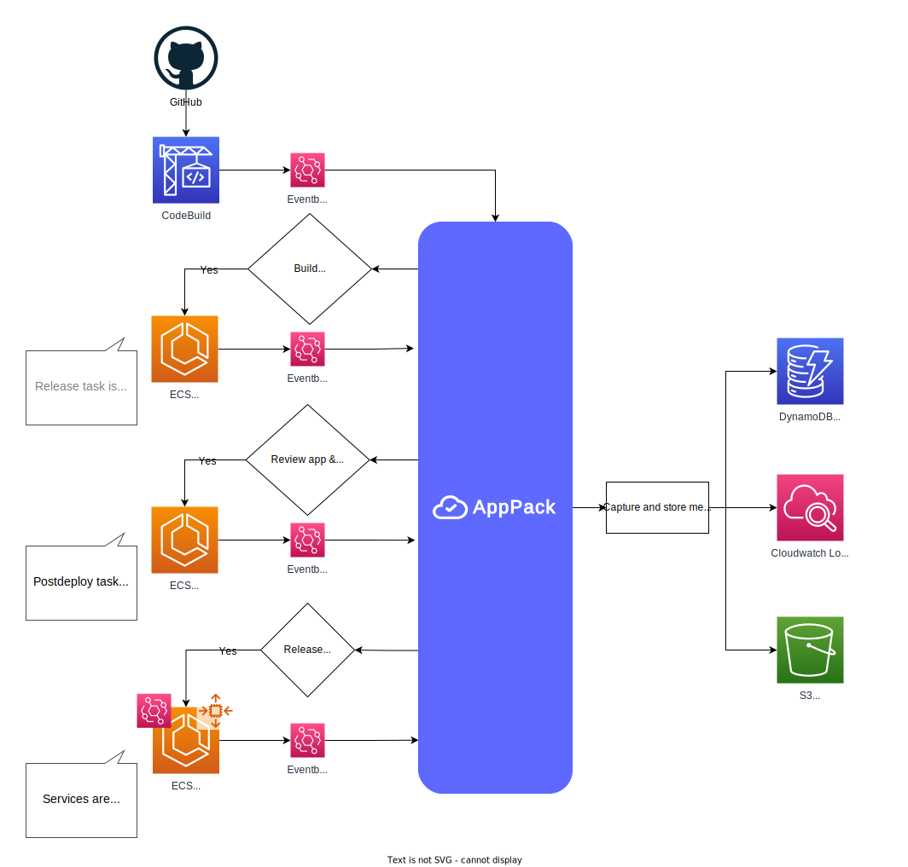

# How AppPack Works

AppPack is comprised of a multiple systems which work together to provide a seamless developer experience on top of AWS' built-in managed services.

## Cloudformation Templates

[Cloudformation](https://aws.amazon.com/cloudformation/) is used to create resources in your account. AppPack is not granted permission to manage Cloudformation. The CLI commands [`create`](https://docs.apppack.io/command-line-reference/apppack_create/), [`upgrade`](https://docs.apppack.io/command-line-reference/apppack_upgrade/), and [`destroy`](https://docs.apppack.io/command-line-reference/apppack_destroy/) are all wrappers around Cloudformation. API calls are made directly to AWS from the CLI using your credentials.

## CodeBuild Scripts & Buildpacks

As part of the Cloudformation app creation, AppPack's custom [`buildspec.yml`](https://docs.aws.amazon.com/codebuild/latest/userguide/build-spec-ref.html) is setup in [CodeBuild](https://aws.amazon.com/codebuild/). This script is only modified if an application stack is upgraded and can be viewed/audited in CodeBuild. It leverages [`pack`](https://github.com/buildpacks/pack) and (by default) [Heroku Buildpacks](https://elements.heroku.com/buildpacks) to create container images from your code.

## Command Line Interface

The CLI primarily interacts with different AWS services directly from your machine. It communicates with AppPack for authentication and to provide the list of apps and accounts your user has access to.

## Web Dashboard

The web dashboard at [https://dashboard.apppack.io](https://dashboard.apppack.io) works exactly the same as the CLI. It uses the AWS JavaScript SDK to make calls directly to AWS from your computer. The website is a completely static site (it is served from S3) without any backend that could access your data. After the initial login, all network traffic is direct to AWS.

## Authentication

Authentication is handled via [Auth0](https://auth0.com/). After successfully logging in with an account with a verified email, the CLI or web interface will exchange your login token for AWS keys for an IAM Role specific to the application that is being managed. This is done via the [`WebIdentityCredentials` API](https://docs.aws.amazon.com/AWSJavaScriptSDK/latest/AWS/WebIdentityCredentials.html) either in your web browser or via your terminal. It handles token verification to confirm the user's identity. All _authorization_ happens via [IAM](https://aws.amazon.com/iam/) in your AWS account. AppPack never has access to these keys or the traffic between your device and AWS.

## Orchestrator

The AppPack Orchestrator is primarily responsible for managing the build and deployment pipeline for your application. It is similar to how you might setup a CI system like GitHub Actions or CircleCI. It operates based on events it receives from your account via [EventBridge](https://aws.amazon.com/eventbridge/).

### Events

AppPack receives events from the following services in your AWS account.

#### CodeBuild

[State change and Phase change](https://docs.aws.amazon.com/codebuild/latest/userguide/sample-build-notifications.html) events are used to populate build metadata stored in [S3](https://aws.amazon.com/s3/) and [DynamoDB](https://aws.amazon.com/dynamodb/) in your AWS account. When builds complete successfully, the orchestrator moves to the next step in the CI pipeline. Depending on your application, this may be triggering a release task, triggering a review app post-deploy service, or updating ECS services to trigger a new deployment.

#### ECS

[Task State Change](https://docs.aws.amazon.com/AmazonECS/latest/developerguide/ecs_cwe_events.html#ecs_task_events) events are used to detect when release or post-deploy tasks have completed. Metadata from those events are stored in S3 and/or DynamoDB in your AWS account. On successful completion, the orchestrator will trigger the next step in the CI pipeline. This may be a review app post-deploy or updating ECS services to trigger a new deployment.

[Service Deployment State Change](https://docs.aws.amazon.com/AmazonECS/latest/developerguide/ecs_cwe_events.html#ecs_service_deployment_events) events are used to detect when a service deployment succeeds or fails. This metadata is stored in DynamoDB in your AWS account.

#### SSM Parameter Store

[SSM Parameter Store Change](https://docs.aws.amazon.com/systems-manager/latest/userguide/monitoring-systems-manager-event-examples.html#SSM-Parameter-Store-event-types) events are used for a number of purposes by the orchestrator.

* App user changes: Cloudformation writes a user list to your Parameter Store. AppPack maintains a list of the applications available to each user. Authorization for access to these application is still managed via IAM in your own AWS account.
* Account administrator changes: Cloudformation writes an administrator list to your Parameter Store. AppPack maintains a list of the accounts available to each administrator. Authorization for access to these application is still managed via IAM in your own AWS account
* Service scaling: The CLI writes scaling data to your Parameter Store. AppPack updates ECS services and App Autoscaling based on those values.
* Scheduled tasks: The CLI writes scheduled task information to your Parameter Store. AppPack creates/destroys scheduled tasks using EventBridge and ECS. It then handles keeping these tasks up-to-date whenever the services are updated.
* Configuration variables: The CLI writes encrypted configuration variables to your Parameter Store. AppPack does not have permission to decrypt these values, but can read the list of variable names so it can update ECS services and scheduled tasks.

### Workflows

#### CI/CD Pipeline

